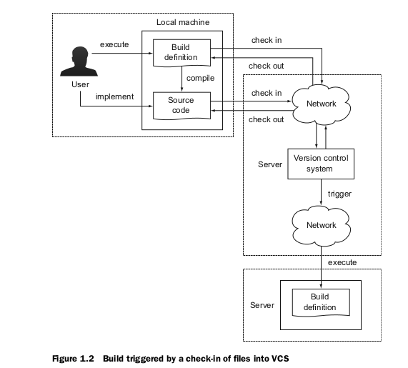
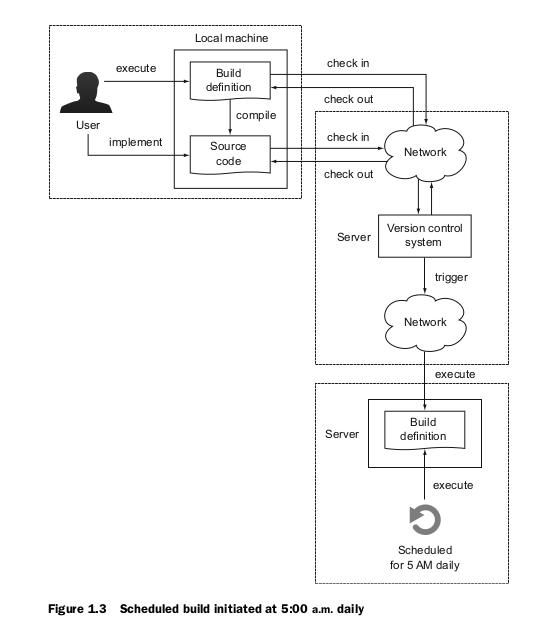

#### A short story
* Tom and Joe work as a software devloper for Acme enterprises, a startup compnay that offers a free online service for funding the best deals in your area.
* The company received investor funding and is now franatically working toward its first official launch.
* So far, development of the software has stayed withing the time and budget constraints.
* However the manual and error-prone build and delivery process slows them down significantly.

#### Life without project automation
* __My IDE does the job:__
  * At Acme, developers do all their coding within the IDE, from navigating through the source code, implementing new features, and compiling and refactoring code, to running unit and integration tests.
  * If the IDE tells them that there is no compilation error and the tests are passing, they check the code into version control so it can be shared with the rest of them.   
  * The IDE is a powerful tool, but every developer will need to install it first with a standerdized version to be able to perform all of these tasks.
* __It works on my box:__
  *  Starting down a ticking clock, Joe checks out the code from version control and realizes that it doesn't compile anymore.
  *  It seems like one of the classes is missing from the source code.
  *  After discussing the issue, Tom realizes that he probably forgot to check in one of his classes, which causes the compilation process to fail.
  *  The rest of the team is now blocked and can't continue their workjntill Tom checks in the missing `source` file.
* __The code integration is a complete disaster:__
  * Acme has two different development groups, one specializing in building the web-based user interface and the other working on the compilation for the whole application, build a deliverable, and deploy it to a web server in a test evnironment.
  * Both teams sit together at Tom's computer to run the compilation fo rthe whole application, build a deliverable, and deploy it to a web server in a test environment.
* __The testing process slows to a crawl:__
  * The quality assurance (QA) team is eager to get their hands on a first version of the application.
  * As we can imagine, they aren't too happy about testing low-quality software.
  * With every fix the development team puts into place, they have to run through the same manual process.
* __Deployment turns into a marathon:__
  * From experience, the team knows that the outcome of deploying an application is unpredicable due to unforeseen problems.
  * The infrastructure and runtime environment has to set up, the database hast to be prepared with seed data.
  * The actual deployment of the applications has to happen, and intial health monitoring needs to be performed.
  * Of course, the team has an action plan in place, but each of the steps has to be executed manually.
  
#### Benefits of project automation

* __Prevents manual intervention:__
  * Having to manually perform steps to produce and deliver software is time-consuming and error-prone.
  * Frankly, as a developer and system administrator, we have better things to do than to handhold a compilation prcess or to copy a file from directory A to directory B.
  * __Any step in our software development process that can be automated should be automated.__
  
* __Creates repeatable builds:__
  * The actual building of our software usually follows predefined and ordered steps.
  * __For example, we compile our source code first, then run our tests, and lastly assemble a deliverable.__
  * We'll need to run the same steps over and over again-every day.
  * This shoud be as easy as pressing a button.

* __Makes builds portable:__
  * We've seen that being able to run a build from and IDE is very limiting.
  * First of all, we'll need to have the particular prduct installed on our machine.
  * Second, the IDE may only be available for a specific operating system.
  * __An automated build shouldn't require a specific runtime environment to work, whether this is an operating system or IDE.__
  * __Optimally, the automated tasks should be executable from the command line, which allows us to run the build from any machine we want, whenever we want.__
  
#### Types of project automation
* __On-demand builds:__
  * The typical use case for on-demand automation is when a user triggers a build on his or her machine.
  * In most cases, the user executes a script on the command line that performs tasks in a predined order.
  

  * __For example:__
    > `compiling source code -> copying a file from directory A to directory B -> assembling a deliverable.`
  * Usually, this type of automation is executed multiple times per day.

* __Triggered builds:__
  * If we are practicing agile software development, we're interested in receiving fast feedback about the health of our project.
  * __We will want to know if our source dode can be compiled without any errors or if there's a potential software defect indicated by a failed unit or integration test.__
  
  * This type of automation is usually triggerd if code was checked into version control.

* __Scheduled builds:__
  * __We can think of scheduled automation as a time-based job scheduler (in the context of a Unix-based operation system, also known as a cron job).__
  
  * It runs in particular intervals or at concrete times - for example, every morning at 1.00 a.m. or every 15 minutes.
  * As with all cron jobs, scheduled automation generally runs on a dedicated server.
  * __The practice that implements scheduled and triggered builds is commonly referred to as continuous integration(CI).__

#### Build tools

  
  